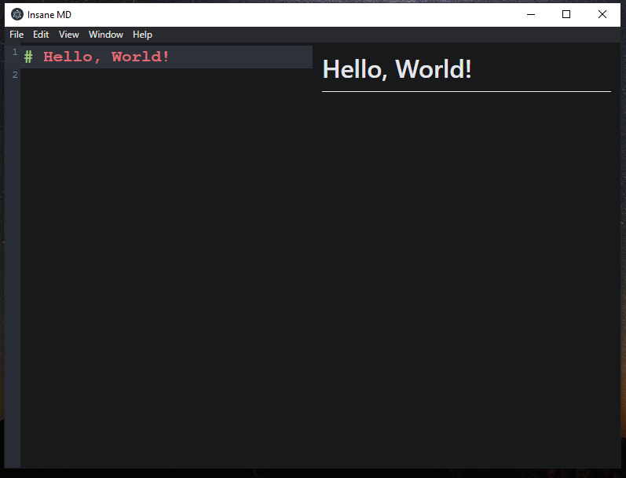

# Insane MD

This is a GitHub repo of the Insane MD desktop app which is a markdown editor. It is a very simple project that I made within a three hours. I made this project as open source because there is lots of things that I have learnt over the process of making it
